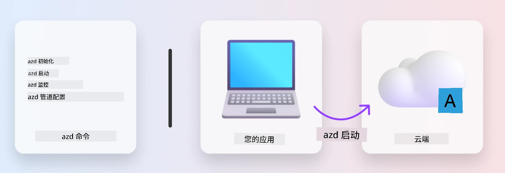
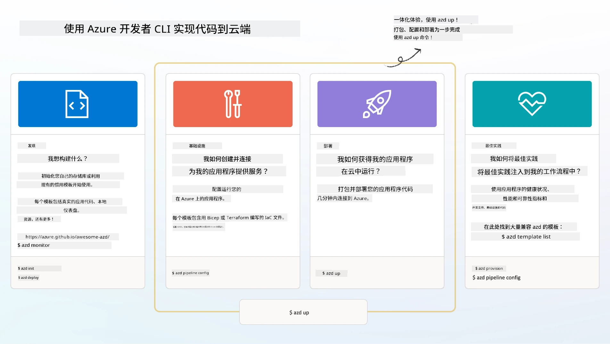

<!--
CO_OP_TRANSLATOR_METADATA:
{
  "original_hash": "06d6207eff634aefcaa41739490a5324",
  "translation_date": "2025-09-24T09:09:04+00:00",
  "source_file": "workshop/docs/instructions/1-Select-AI-Template.md",
  "language_code": "zh"
}
-->
# 1. 选择模板

!!! tip "完成本模块后，你将能够："

    - [ ] 描述什么是 AZD 模板
    - [ ] 发现并使用适用于 AI 的 AZD 模板
    - [ ] 开始使用 AI Agents 模板
    - [ ] **实验 1：** 使用 GitHub Codespaces 快速入门 AZD

---

## 1. 建造者类比

从零开始构建一个现代化的企业级 AI 应用可能会让人望而却步。这有点像自己动手一砖一瓦地建造新家。是的，这可以做到！但这并不是实现理想结果的最有效方式！

相反，我们通常会从现有的 _设计蓝图_ 开始，并与建筑师合作，根据个人需求进行定制。这正是构建智能应用时应该采取的方式。首先，找到一个适合问题领域的优秀设计架构。然后，与解决方案架构师合作，根据具体场景定制和开发解决方案。

但我们在哪里可以找到这些设计蓝图？又如何找到愿意教我们如何定制和部署这些蓝图的架构师？在本次研讨会中，我们将通过介绍三项技术来回答这些问题：

1. [Azure Developer CLI](https://aka.ms/azd) - 一个开源工具，可以加速开发者从本地开发（构建）到云部署（发布）的路径。
1. [Azure AI Foundry Templates](https://ai.azure.com/templates) - 标准化的开源代码库，包含用于部署 AI 解决方案架构的示例代码、基础设施和配置文件。
1. [GitHub Copilot Agent Mode](https://code.visualstudio.com/docs/copilot/chat/chat-agent-mode) - 一个基于 Azure 知识的编码助手，可以通过自然语言指导我们浏览代码库并进行修改。

有了这些工具，我们现在可以 _发现_ 合适的模板，_部署_ 以验证其可行性，并根据具体场景 _定制_ 它。让我们深入了解这些工具的工作原理。

---

## 2. Azure Developer CLI

[Azure Developer CLI](https://learn.microsoft.com/en-us/azure/developer/azure-developer-cli/)（简称 `azd`）是一个开源命令行工具，通过一组开发者友好的命令，可以加速从代码到云的旅程，并在 IDE（开发）和 CI/CD（开发运维）环境中保持一致。

使用 `azd`，你的部署过程可以简单到：

- `azd init` - 从现有 AZD 模板初始化一个新的 AI 项目。
- `azd up` - 一步完成基础设施的配置和应用的部署。
- `azd monitor` - 获取已部署应用的实时监控和诊断信息。
- `azd pipeline config` - 设置 CI/CD 管道以自动化部署到 Azure。

**🎯 | 练习**：<br/> 在你的 GitHub Codespaces 环境中探索 `azd` 命令行工具。首先输入以下命令，查看该工具的功能：

```bash title="" linenums="0"
azd help
```



---

## 3. AZD 模板

为了让 `azd` 实现上述功能，它需要知道要配置的基础设施、要强制执行的配置设置以及要部署的应用。这就是 [AZD 模板](https://learn.microsoft.com/en-us/azure/developer/azure-developer-cli/azd-templates?tabs=csharp) 的作用。

AZD 模板是开源代码库，将示例代码与部署解决方案架构所需的基础设施和配置文件结合在一起。
通过采用 _基础设施即代码_（IaC）的方法，它们允许模板资源定义和配置设置像应用源代码一样进行版本控制——从而在项目用户之间创建可重复使用且一致的工作流。

在为 _你的_ 场景创建或重用 AZD 模板时，请考虑以下问题：

1. 你在构建什么？→ 是否有适合该场景的模板代码？
1. 你的解决方案架构如何？→ 是否有包含必要资源的模板？
1. 你的解决方案如何部署？→ 想想 `azd deploy` 和预处理/后处理钩子！
1. 如何进一步优化？→ 想想内置的监控和自动化管道！

**🎯 | 练习**：<br/> 
访问 [Awesome AZD](https://azure.github.io/awesome-azd/) 画廊，使用筛选器探索当前可用的 250+ 模板。看看是否能找到一个符合 _你的_ 场景需求的模板。



---

## 4. AI 应用模板

---

