<!--
CO_OP_TRANSLATOR_METADATA:
{
  "original_hash": "7816c6ec50c694c331e7c6092371be4d",
  "translation_date": "2025-09-24T09:14:38+00:00",
  "source_file": "workshop/docs/instructions/2-Validate-AI-Template.md",
  "language_code": "zh"
}
-->
# 2. 验证模板

!!! tip "完成本模块后，您将能够："

    - [ ] 分析 AI 解决方案架构
    - [ ] 了解 AZD 部署工作流程
    - [ ] 使用 GitHub Copilot 获取 AZD 使用帮助
    - [ ] **实验 2：** 部署并验证 AI Agents 模板

---

## 1. 介绍

[Azure Developer CLI](https://learn.microsoft.com/en-us/azure/developer/azure-developer-cli/) 或 `azd` 是一个开源命令行工具，可简化开发人员在 Azure 上构建和部署应用程序的工作流程。

[AZD 模板](https://learn.microsoft.com/azure/developer/azure-developer-cli/azd-templates) 是标准化的代码库，包含示例应用程序代码、_基础设施即代码_ 资产以及 `azd` 配置文件，用于构建统一的解决方案架构。通过简单的 `azd provision` 命令即可完成基础设施的配置，而使用 `azd up` 则可以同时配置基础设施并部署应用程序！

因此，启动您的应用程序开发过程可以像找到最接近您应用程序和基础设施需求的 _AZD Starter 模板_ 一样简单，然后根据您的场景需求定制代码库。

在开始之前，请确保您已安装 Azure Developer CLI。

1. 打开 VS Code 终端并输入以下命令：

      ```bash title="" linenums="0"
      azd version
      ```

1. 您应该会看到类似这样的内容！

      ```bash title="" linenums="0"
      azd version 1.19.0 (commit b3d68cea969b2bfbaa7b7fa289424428edb93e97)
      ```

**现在您可以使用 azd 选择并部署模板了**

---

## 2. 模板选择

Azure AI Foundry 平台提供了一组[推荐的 AZD 模板](https://learn.microsoft.com/en-us/azure/ai-foundry/how-to/develop/ai-template-get-started)，涵盖了流行的解决方案场景，例如 _多代理工作流自动化_ 和 _多模态内容处理_。您还可以通过访问 Azure AI Foundry 门户来发现这些模板。

1. 访问 [https://ai.azure.com/templates](https://ai.azure.com/templates)
1. 登录 Azure AI Foundry 门户后，您会看到类似这样的页面。

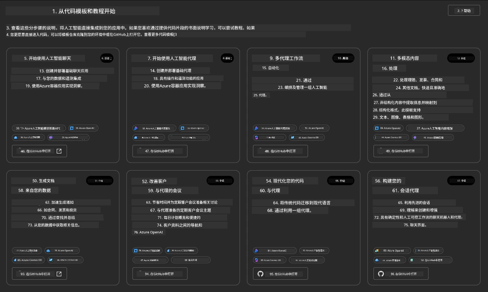

**基础选项** 是您的入门模板：

1. [ ] [Get Started with AI Chat](https://github.com/Azure-Samples/get-started-with-ai-chat)，将一个基本聊天应用程序 _与您的数据_ 部署到 Azure Container Apps。使用此模板探索基本的 AI 聊天机器人场景。
1. [X] [Get Started with AI Agents](https://github.com/Azure-Samples/get-started-with-ai-agents)，同样部署一个标准的 AI Agent（使用 Azure AI Agent Service）。使用此模板熟悉涉及工具和模型的代理式 AI 解决方案。

在新浏览器标签中访问第二个链接（或点击相关卡片上的 `Open in GitHub`）。您应该会看到此 AZD 模板的代码库。花一分钟时间浏览 README。应用程序架构如下所示：

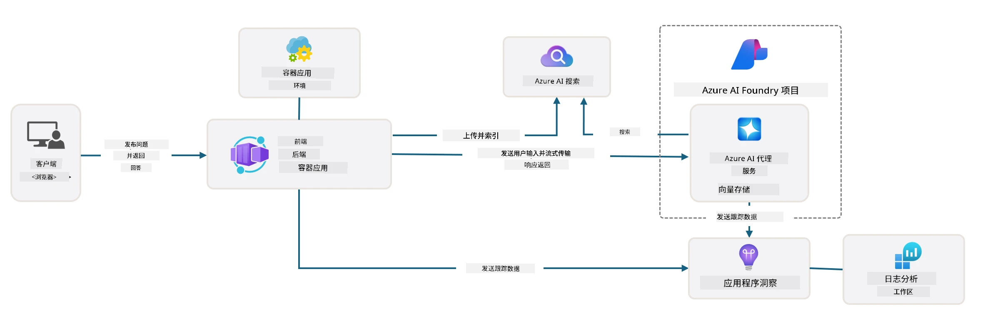

---

## 3. 模板激活

让我们尝试部署此模板并确保其有效。我们将遵循 [Getting Started](https://github.com/Azure-Samples/get-started-with-ai-agents?tab=readme-ov-file#getting-started) 部分中的指南。

1. 点击[此链接](https://github.com/codespaces/new/Azure-Samples/get-started-with-ai-agents) - 确认默认操作为 `Create codespace`
1. 这将打开一个新的浏览器标签 - 等待 GitHub Codespaces 会话加载完成
1. 在 Codespaces 中打开 VS Code 终端 - 输入以下命令：

   ```bash title="" linenums="0"
   azd up
   ```

完成此命令触发的工作流程步骤：

1. 系统会提示您登录 Azure - 按照说明进行身份验证
1. 输入一个唯一的环境名称 - 例如，我使用了 `nitya-mshack-azd`
1. 这将创建一个 `.azure/` 文件夹 - 您会看到一个以环境名称命名的子文件夹
1. 系统会提示您选择订阅名称 - 选择默认选项
1. 系统会提示您选择位置 - 使用 `East US 2`

现在，等待配置完成。**这需要 10-15 分钟**

1. 完成后，您的控制台会显示如下的成功消息：
      ```bash title="" linenums="0"
      SUCCESS: Your up workflow to provision and deploy to Azure completed in 10 minutes 17 seconds.
      ```

1. 您的 Azure Portal 现在会有一个以环境名称命名的资源组：

      

1. **现在您可以验证已部署的基础设施和应用程序了**。

---

## 4. 模板验证

1. 访问 Azure Portal [资源组](https://portal.azure.com/#browse/resourcegroups) 页面 - 按提示登录
1. 点击您的环境名称对应的资源组 - 您会看到如下页面

      - 点击 Azure Container Apps 资源
      - 点击 _Essentials_ 部分（右上角）的应用程序 URL

1. 您应该会看到一个托管的应用程序前端 UI，如下所示：

   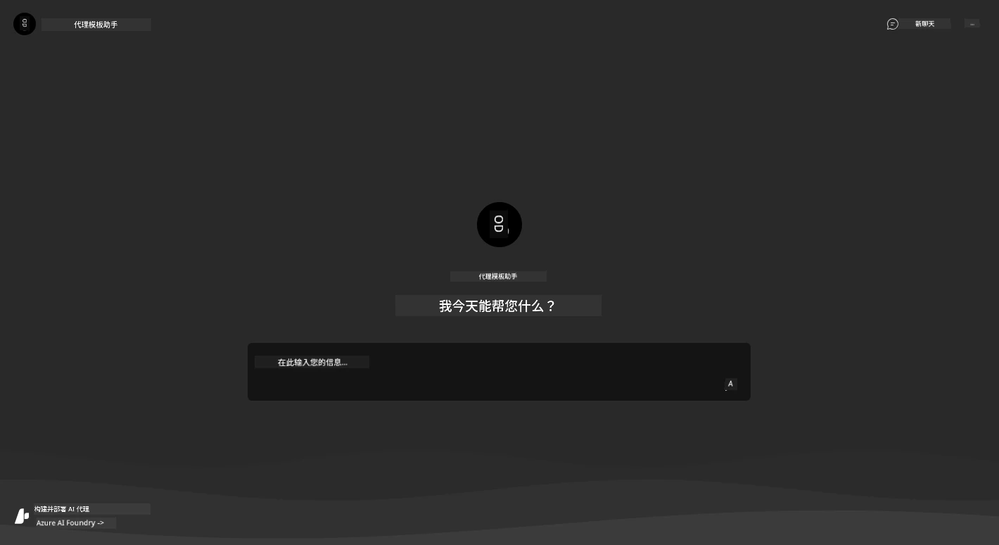

1. 尝试问几个[示例问题](https://github.com/Azure-Samples/get-started-with-ai-agents/blob/main/docs/sample_questions.md)

      1. 问：```法国的首都是哪里？``` 
      1. 问：```200美元以下适合两人的最佳帐篷是什么？它有哪些特点？```

1. 您应该会得到类似如下的答案。_但它是如何工作的呢？_

      

---

## 5. 代理验证

Azure Container App 部署了一个端点，该端点连接到为此模板在 Azure AI Foundry 项目中配置的 AI Agent。让我们看看这意味着什么。

1. 返回 Azure Portal 中资源组的 _概览_ 页面

1. 点击列表中的 `Azure AI Foundry` 资源

1. 您应该会看到如下页面。点击 `Go to Azure AI Foundry Portal` 按钮。
   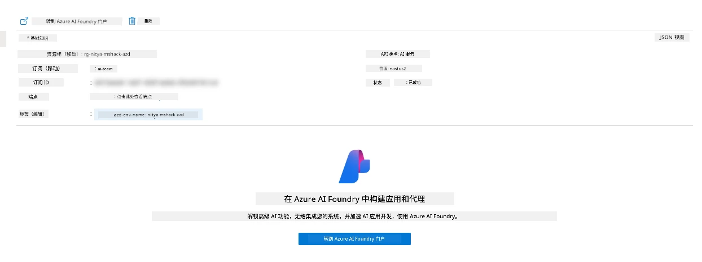

1. 您应该会看到您的 AI 应用程序的 Foundry 项目页面
   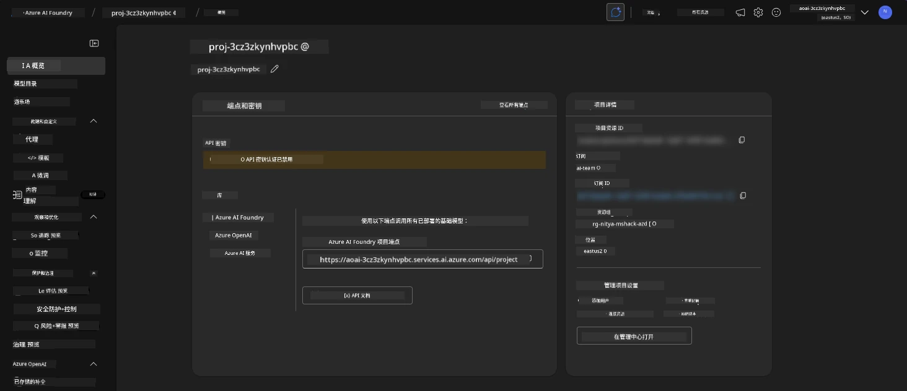

1. 点击 `Agents` - 您会看到项目中配置的默认代理
   

1. 选择它 - 您会看到代理的详细信息。注意以下内容：

      - 代理默认使用文件搜索（始终）
      - 代理的 `Knowledge` 表明它上传了 32 个文件（用于文件搜索）
      

1. 在左侧菜单中找到 `Data+indexes` 选项并点击查看详细信息。

      - 您应该会看到上传的 32 个数据文件。
      - 这些文件对应于 `src/files` 文件夹中的 12 个客户文件和 20 个产品文件
      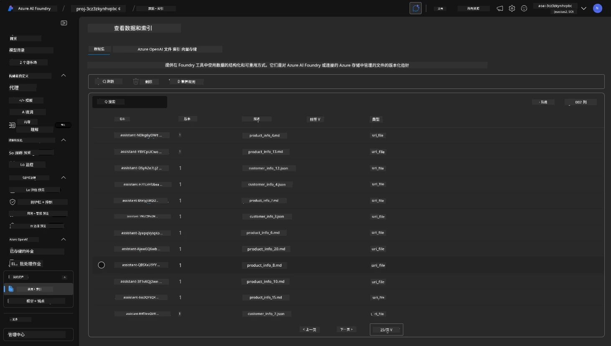

**您已验证代理操作！**

1. 代理的响应基于这些文件中的知识。
1. 您现在可以提出与这些数据相关的问题，并获得基于数据的响应。
1. 示例：`customer_info_10.json` 描述了 "Amanda Perez" 的 3 次购买记录

返回浏览器标签中的 Container App 端点并询问：`Amanda Perez 拥有哪些产品？`。您应该会看到类似如下的内容：

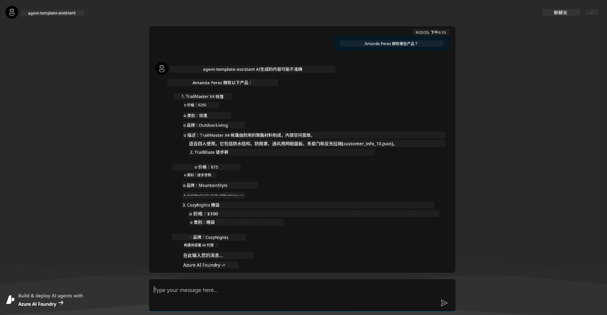

---

## 6. 代理游乐场

让我们通过在代理游乐场中试用代理，进一步了解 Azure AI Foundry 的功能。

1. 返回 Azure AI Foundry 中的 `Agents` 页面 - 选择默认代理
1. 点击 `Try in Playground` 选项 - 您应该会看到如下的游乐场 UI
1. 问同样的问题：`Amanda Perez 拥有哪些产品？`

    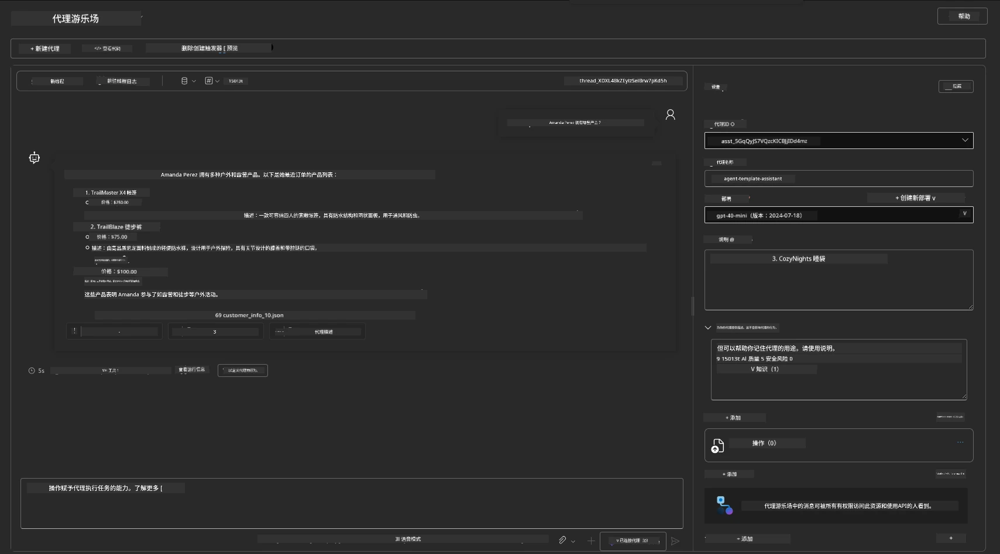

您会得到相同（或类似）的响应 - 但您还会获得额外的信息，用于了解您的代理应用程序的质量、成本和性能。例如：

1. 注意响应引用了用于“支持”响应的数据文件
1. 将鼠标悬停在任何文件标签上 - 数据是否与您的查询和显示的响应匹配？

您还会看到响应下方的 _统计_ 行。

1. 将鼠标悬停在任何指标上 - 例如，安全性。您会看到类似如下的内容
1. 评估的评分是否与您对响应安全级别的直觉相符？

      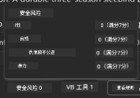

---

## 7. 内置可观察性

可观察性是指为应用程序添加仪器以生成数据，用于理解、调试和优化其操作。为了感受这一点：

1. 点击 `View Run Info` 按钮 - 您应该会看到如下视图。这是 [代理追踪](https://learn.microsoft.com/en-us/azure/ai-foundry/how-to/develop/trace-agents-sdk#view-trace-results-in-the-azure-ai-foundry-agents-playground) 的一个示例。_您也可以通过点击顶级菜单中的 Thread Logs 获得此视图_。

   - 了解代理运行步骤和使用的工具
   - 理解响应的总 Token 数量（与输出 Token 使用量的对比）
   - 理解延迟以及执行过程中时间的分布

      

1. 点击 `Metadata` 标签以查看运行的其他属性，这些属性可能为后续调试问题提供有用的上下文。

      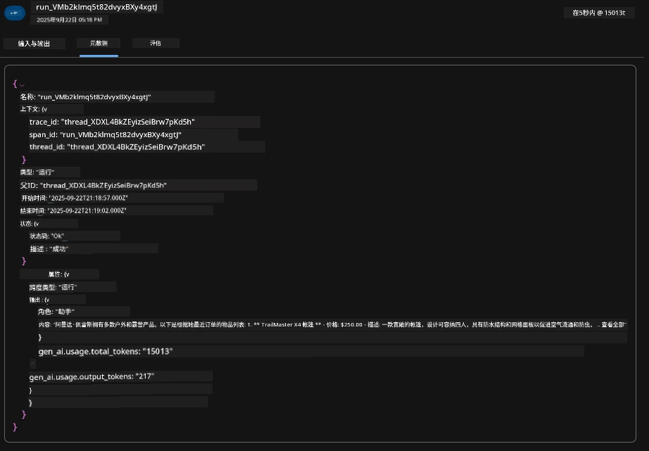

1. 点击 `Evaluations` 标签以查看对代理响应的自动评估。这些评估包括安全性评估（例如，自我伤害）和代理特定评估（例如，意图解析、任务遵守）。

      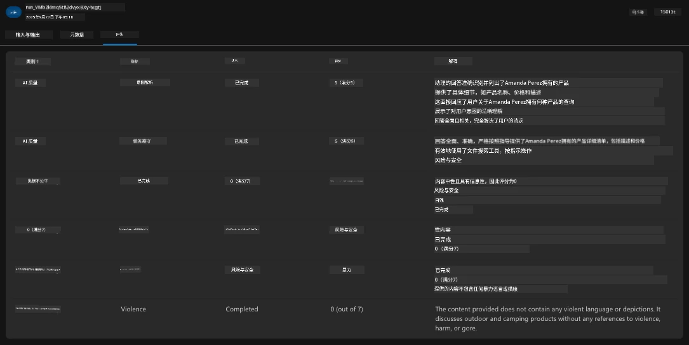

1. 最后但同样重要的是，点击侧边栏菜单中的 `Monitoring` 标签。

      - 在显示的页面中选择 `Resource usage` 标签 - 查看指标。
      - 跟踪应用程序使用情况，包括成本（Token）和负载（请求）。
      - 跟踪应用程序的延迟，从第一个字节（输入处理）到最后一个字节（输出）。

      

---

## 8. 环境变量

到目前为止，我们已经通过浏览器完成了部署，并验证了我们的基础设施已配置且应用程序已运行。但要以 _代码优先_ 的方式使用应用程序，我们需要在本地开发环境中配置相关变量，以便与这些资源协同工作。使用 `azd` 可以轻松完成。

1. Azure Developer CLI [使用环境变量](https://learn.microsoft.com/en-us/azure/developer/azure-developer-cli/manage-environment-variables?tabs=bash) 来存储和管理应用程序部署的配置设置。

1. 环境变量存储在 `.azure/<env-name>/.env` 中 - 这将它们限定在部署期间使用的 `env-name` 环境中，并帮助您在同一代码库中的不同部署目标之间隔离环境。

1. 环境变量会在 `azd` 执行特定命令（例如 `azd up`）时自动加载。注意，`azd` 不会自动读取 _操作系统级_ 环境变量（例如，在 shell 中设置的变量） - 而是使用 `azd set env` 和 `azd get env` 在脚本中传递信息。

让我们尝试一些命令：

1. 获取此环境中 `azd` 设置的所有环境变量：

      ```bash title="" linenums="0"
      azd env get-values
      ```
      
      您会看到类似如下的内容：

      ```bash title="" linenums="0"
      AZURE_AI_AGENT_DEPLOYMENT_NAME="gpt-4o-mini"
      AZURE_AI_AGENT_NAME="agent-template-assistant"
      AZURE_AI_EMBED_DEPLOYMENT_NAME="text-embedding-3-small"
      AZURE_AI_EMBED_DIMENSIONS=100
      ...
      ```

1. 获取特定值 - 例如，我想知道是否设置了 `AZURE_AI_AGENT_MODEL_NAME` 值

      ```bash title="" linenums="0"
      azd env get-value AZURE_AI_AGENT_MODEL_NAME 
      ```
      
      您会看到类似如下的内容 - 默认情况下未设置！

      ```bash title="" linenums="0"
      ERROR: key 'AZURE_AI_AGENT_MODEL_NAME' not found in the environment values
      ```

1. 为 `azd` 设置新的环境变量。在这里，我们更新代理模型名称。_注意：所做的任何更改将立即反映在 `.azure/<env-name>/.env` 文件中。

      ```bash title="" linenums="0"
      azd env set AZURE_AI_AGENT_MODEL_NAME gpt-4.1
      azd env set AZURE_AI_AGENT_MODEL_VERSION 2025-04-14
      azd env set AZURE_AI_AGENT_DEPLOYMENT_CAPACITY 150
      ```

      现在，我们应该发现该值已设置：

      ```bash title="" linenums="0"
      azd env get-value AZURE_AI_AGENT_MODEL_NAME 
      ```

1. 注意某些资源是持久的（例如，模型部署），需要的不仅仅是一个 `azd up` 来强制重新部署。让我们尝试拆除原始部署并使用更改后的环境变量重新部署。

1. **刷新** 如果您之前使用 azd 模板部署了基础设施 - 您可以使用以下命令 _刷新_ 本地环境变量的状态，以反映当前的 Azure 部署状态：


      ```bash title="" linenums="0"
      azd env refresh
      ```

      这是一个强大的方法，可以在两个或多个本地开发环境之间同步环境变量（例如，拥有多个开发者的团队），使部署的基础设施成为环境变量状态的最终依据。团队成员只需刷新变量即可重新同步。

---

## 9. 恭喜 🏆

你刚刚完成了一个端到端的工作流程，其中包括：

- [X] 选择了你想使用的 AZD 模板
- [X] 使用 GitHub Codespaces 启动了模板
- [X] 部署了模板并验证其正常运行

---

