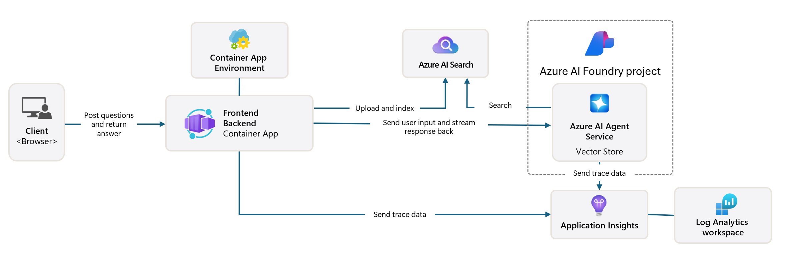

# Lab 02: Analyze Template

!!! quote "BY THE END OF THIS LAB YOU SHOULD HAVE"
    - [ ] Activated GitHub Copilot for Azure
    - [ ] Understood the Application Architecture
    - [ ] Explored the AZD template structure

---

With AZD templates and the Azure Developer CLI (`azd`) we can quickly jumpstart our AI development journey with standardized repositories that provide sample code, infrastructre and configuration files - in the form of a ready-to-deploy _starter_ project.

**But now, we need to understand the project structure and codebase - and be able to customize the AZD template - without any prior experience or understanding of AZD!**

---

## 1. Activate GitHub Copilot

### 1.1 Install GitHub Copilot Chat

It's time to explore [GitHub Copilot with Agent Mode](https://code.visualstudio.com/docs/copilot/chat/chat-agent-mode). Now, we can use natural language to describe our task at a high level, and get assistance in execution. For this lab, we'll use the [Copilot Free plan](https://github.com/github-copilot/signup) which has a monthly limit for completions and chat interactions.

The extension can be installed from the marketplace, but should already be available in your Codespaces environment. _Click `Open Chat` from the Copilot icon drop-down - and type a prompt like `What can you do?`_ - you may be prompted to log in. **GitHub Copilot Chat is ready**.

### 1.2. Install MCP Servers

For Agent mode to be effective, it needs access to the right tools to help it retrieve knowledge or take actions. This is where MCP servers can help. We'll configure the following servers:

1. [Azure MCP Server]()
1. [Microsoft Docs MCP Server]()

To activate these:

1. Create a file called `.vscode/mcp.json` if it does not exist
1. Copy the following into that file - and start the servers!
   ```json title=".vscode/mcp.json"
   {
      "servers": {
         "Azure MCP Server": {
            "command": "npx",
            "args": [
            "-y",
            "@azure/mcp@latest",
            "server",
            "start"
            ]
         },
         "microsoft.docs.mcp": {
            "type": "http",
            "url": "https://learn.microsoft.com/api/mcp"
         }
      }
   }
   ```

??? warning "You may get an error that `npx` is not installed (click to expand for fix)"

      To fix,this open the `.devcontainer/devcontainer.json` file and add this line to the features section. Then rebuild the container. You should now have `npx` installed.

      ```title="" linenums="0"
         "features": {
            "ghcr.io/devcontainers/features/node:1": {},
            ...
         },
      ```

---

### 1.3. Test GitHub Copilot Chat

**First use `az login` to authenticate with Azure from VS Code command line.**

You should now be able to query your Azure subscription status, and ask questions about deployed resources or configuration. Try these prompts:

1. `List my Azure resource groups`
1. `#foundry list my current deployments`

You can also ask questions about Azure documentation and get responses grounded in the Microsoft Docs MCP server. Try these prompts:

1. `#microsoft_docs_search What is Azure Developer CLI?`
1. `#microsoft_docs_search Show me a Python tutorial to chat with deployed model`

Or you can ask for code snippets to complete a task. Try this prompt.

1. `Give me a Python code example that uses AAD for an interactive chat client`

In `Ask` mode, this will provide code that you can copy-paste and try out. In `Agent` mode, this might go a step further and create the relevant resources for you - including setup scripts and documentation - to help you execute that task.

**You are now equipped to start exploring the template repository**

---

## 2. Deconstruct Architecture

??? prompt "ASK: Explain the application architecture in docs/images/architecture.png in 1 paragraph"

      This application is an AI-powered chat application built on Azure that demonstrates a modern agent-based architecture. The solution centers around an Azure Container App that hosts the main application code, which processes user input and generates intelligent responses through an AI agent. 
      
      The architecture leverages Azure AI Foundry Project as the foundation for AI capabilities, connecting to Azure AI Services that provide the underlying language models (such as GPT-4o-mini) and agent functionality. User interactions flow through a React-based frontend to a FastAPI backend that communicates with the AI agent service for generating contextual responses. 
      
      The system incorporates knowledge retrieval capabilities through either file search or Azure AI Search service, allowing the agent to access and cite information from uploaded documents. For operational excellence, the architecture includes comprehensive monitoring through Application Insights and Log Analytics Workspace for tracing, logging, and performance optimization. 
      
      Azure Storage provides blob storage for application data and file uploads, while Managed Identity ensures secure access between Azure resources without storing credentials. The entire solution is designed for scalability and maintainability, with the containerized application automatically scaling based on demand while providing built-in security, monitoring, and CI/CD capabilities through Azure's managed services ecosystem.



---

## 3. Repository Structure

!!! prompt "ASK: Explain the template folder structure. Start with a visual hierarchical diagram."

??? info "ANSWER: Visual Hierarchical Diagram"

      ```bash title="" 
      get-started-with-ai-agents/
      ├── 📋 Configuration & Setup
      │   ├── azure.yaml                    # Azure Developer CLI configuration
      │   ├── docker-compose.yaml           # Local development containers
      │   ├── pyproject.toml                # Python project configuration
      │   ├── requirements-dev.txt          # Development dependencies
      │   └── .devcontainer/                # VS Code dev container setup
      │
      ├── 🏗️ Infrastructure (infra/)
      │   ├── main.bicep                    # Main infrastructure template
      │   ├── api.bicep                     # API-specific resources
      │   ├── main.parameters.json          # Infrastructure parameters
      │   └── core/                         # Modular infrastructure components
      │       ├── ai/                       # AI service configurations
      │       ├── host/                     # Hosting infrastructure
      │       ├── monitor/                  # Monitoring and logging
      │       ├── search/                   # Azure AI Search setup
      │       ├── security/                 # Security and identity
      │       └── storage/                  # Storage account configs
      │
      ├── 💻 Application Source (src/)
      │   ├── api/                          # Backend API
      │   │   ├── main.py                   # FastAPI application entry
      │   │   ├── routes.py                 # API route definitions
      │   │   ├── search_index_manager.py   # Search functionality
      │   │   ├── data/                     # API data handling
      │   │   ├── static/                   # Static web assets
      │   │   └── templates/                # HTML templates
      │   ├── frontend/                     # React/TypeScript frontend
      │   │   ├── package.json              # Node.js dependencies
      │   │   ├── vite.config.ts            # Vite build configuration
      │   │   └── src/                      # Frontend source code
      │   ├── data/                         # Sample data files
      │   │   └── embeddings.csv            # Pre-computed embeddings
      │   ├── files/                        # Knowledge base files
      │   │   ├── customer_info_*.json      # Customer data samples
      │   │   └── product_info_*.md         # Product documentation
      │   ├── Dockerfile                    # Container configuration
      │   └── requirements.txt              # Python dependencies
      │
      ├── 🔧 Automation & Scripts (scripts/)
      │   ├── postdeploy.sh/.ps1           # Post-deployment setup
      │   ├── setup_credential.sh/.ps1     # Credential configuration
      │   ├── validate_env_vars.sh/.ps1    # Environment validation
      │   └── resolve_model_quota.sh/.ps1  # Model quota management
      │
      ├── 🧪 Testing & Evaluation
      │   ├── tests/                        # Unit and integration tests
      │   │   └── test_search_index_manager.py
      │   ├── evals/                        # Agent evaluation framework
      │   │   ├── evaluate.py               # Evaluation runner
      │   │   ├── eval-queries.json         # Test queries
      │   │   └── eval-action-data-path.json
      │   ├── sandbox/                      # Development playground
      │   │   ├── 1-quickstart.py           # Getting started examples
      │   │   └── aad-interactive-chat.py   # Authentication examples
      │   └── airedteaming/                 # AI safety evaluation
      │       └── ai_redteaming.py          # Red team testing
      │
      ├── 📚 Documentation (docs/)
      │   ├── deployment.md                 # Deployment guide
      │   ├── local_development.md          # Local setup instructions
      │   ├── troubleshooting.md            # Common issues & fixes
      │   ├── azure_account_setup.md        # Azure prerequisites
      │   └── images/                       # Documentation assets
      │
      └── 📄 Project Metadata
         ├── README.md                     # Project overview
         ├── CODE_OF_CONDUCT.md           # Community guidelines
         ├── CONTRIBUTING.md              # Contribution guide
         ├── LICENSE                      # License terms
         └── next-steps.md                # Post-deployment guidance
      ```

### 3.1. Core App Architecture

This template follows a **full-stack web application** pattern with:

- **Backend**: Python FastAPI with Azure AI integration
- **Frontend**: TypeScript/React with Vite build system
- **Infrastructure**: Azure Bicep templates for cloud resources
- **Containerization**: Docker for consistent deployment

### 3.2 Infra As Code (bicep)

The infrastructure layer uses **Azure Bicep** templates organized modularly:

   - **`main.bicep`**: Orchestrates all Azure resources
   - **`core/` modules**: Reusable components for different services
      - AI services (Azure OpenAI, AI Search)
      - Container hosting (Azure Container Apps)
      - Monitoring (Application Insights, Log Analytics)
      - Security (Key Vault, Managed Identity)

### 3.3 Application Source (`src/`)

**Backend API (`src/api/`)**:

- FastAPI-based REST API
- Azure AI Agent service integration
- Search index management for knowledge retrieval
- File upload and processing capabilities

**Frontend (`src/frontend/`)**:

- Modern React/TypeScript SPA
- Vite for fast development and optimized builds
- Chat interface for agent interactions

**Knowledge Base (`src/files/`)**:

- Sample customer and product data
- Demonstrates file-based knowledge retrieval
- JSON and Markdown format examples


### 3.4 DevOps & Automation

**Scripts (`scripts/`)**:

- Cross-platform PowerShell and Bash scripts
- Environment validation and setup
- Post-deployment configuration
- Model quota management

**Azure Developer CLI Integration**:

- `azure.yaml` configuration for `azd` workflows
- Automated provisioning and deployment
- Environment variable management

### 3.5 Testing & Quality Assurance

**Evaluation Framework (`evals/`)**:

- Agent performance evaluation
- Query-response quality testing
- Automated assessment pipeline

**AI Safety (`airedteaming/`)**:

- Red team testing for AI safety
- Security vulnerability scanning
- Responsible AI practices

---

## 4. Congratulations 🏆

You successfully used GitHub Copilot Chat with MCP servers, to explore the repository.

- [X] Activated GitHub Copilot for Azure
- [X] Understood the Application Architecture
- [X] Explored the AZD template structure

This gives you a sense of the _infrastructure as code_ assets for this template. Next, we'll look at the configuration file for AZD.


