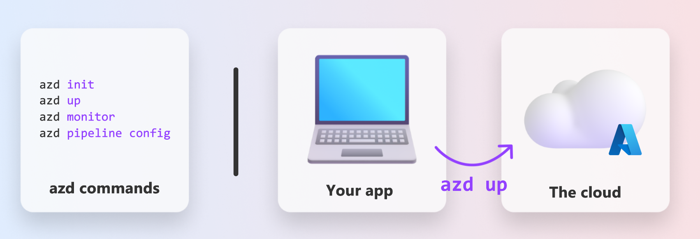
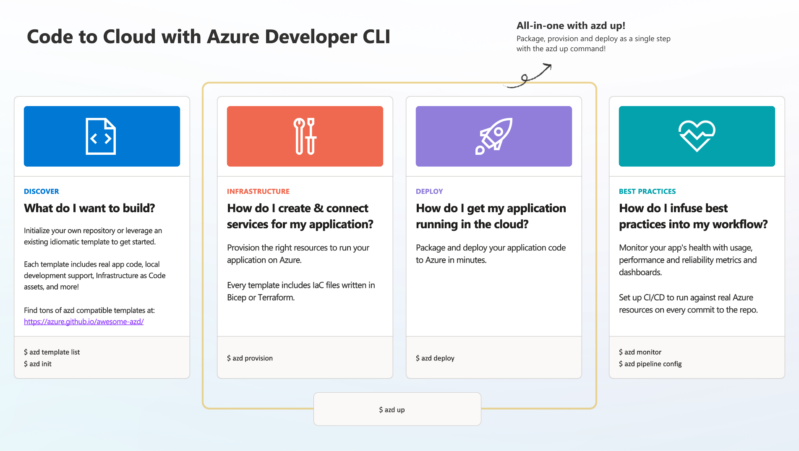

# 1. Select a Template

!!! tip "BY THE END OF THIS MODULE YOU WILL BE ABLE TO"

    - [ ] Describe what AZD templates are
    - [ ] Discover and use AZD templates for AI
    - [ ] Get started with the AI Agents template
    - [ ] **Lab 1:** AZD Quickstart with GitHub Codespaces

---

## 1. A Builder Analogy

Building a modern enterprise-ready AI application _from scratch_ can be daunting. It's a little bit like building your new home on your own, brick by brick. Yes, it can be done! But it is not the most effective way to get the desired end result! 

Instead, we often start with an existing _design blueprint_, and work with an architect to customize it to our personal requirements. And that's exactly the approachto take when building intelligent applications. First, find a good design architecture that fits your problem space. Then work with a solution architect to customize and develop the solution for your specific scenario.

But where can we find these design blueprints? And how do we find an architect that is willing to teach us how to customize and deploy these blueprints on our own? In this workshop, we answer those questions by introducing you to three technologies:

1. [Azure Developer CLI](https://aka.ms/azd) - an open-source tool that accelerates the developer path in going from local development (build) to cloud deployment (ship).
1. [Azure AI Foundry Templates](https://ai.azure.com/templates) - standardized open-source repositories containing sample code, infrastructure and configuration files for deploying an AI solution architecture.
1. [GitHub Copilot Agent Mode](https://code.visualstudio.com/docs/copilot/chat/chat-agent-mode) - a coding agent grounded in Azure knowledge, that can guide us in navigating the codebase and making changes - using natural language.

With these tools in hand, we can now _discover_ the right template, _deploy_ it to validate it works, and _customize_ it to suit our specific scenarios. Let's dive in and learn how these work.


---

## 2. Azure Developer CLI

The [Azure Developer CLI](https://learn.microsoft.com/en-us/azure/developer/azure-developer-cli/) (or `azd`) is an open-source commandline tool that can speed up your code-to-cloud journey with a set of developer-friendly commands that work consistently across your IDE (development) and CI/CD (devops) environments.

With `azd`, your deployment journey can be as simple as:

- `azd init` - Initializes a new AI project from an existing AZD template.
- `azd up` - Provisions infrastructure and deploy your application in one step.
- `azd monitor` - Get real-time monitoring and diagnostics for your deployed application.
- `azd pipeline config` - Setup CI/CD pipelines to automate deployment to Azure.

**🎯 | EXERCISE**: <br/> Explore the `azd` commandline tool in your GitHub Codespaces environment now. Start by typing this command to see what the tool can do:

```bash title="" linenums="0"
azd help
```



---

## 3. The AZD Template

For `azd` to achieve this, it needs to know the infrastructure to provision, the configuration settings to enforce, and the application to deploy. This is where [AZD templates](https://learn.microsoft.com/en-us/azure/developer/azure-developer-cli/azd-templates?tabs=csharp) come in. 

AZD templates are open-source repositories that combine sample code with infrastructure and configuraton files required for deploying the solution architecture.
By using an _Infrastructure-as-Code_ (IaC) approach, they allow template resource definitions and configuration settings to be version-controller (just like the app source code) - creating reusable and consistent workflows across users of that project.

When creating or reusing an AZD template for _your_ scenario, consider these questions:

1. What are you building? → Is there a template that has starter code for that scenario?
1. How is your solution architected? → Is there a template that has the necessary resources?
1. How is your solution deployed? → Think `azd deploy` with pre/post-processing hooks!
1. How can you optimize it further? → Think built-in monitoring and automation pipelines!

**🎯 | EXERCISE**: <br/> 
Visit the [Awesome AZD](https://azure.github.io/awesome-azd/) gallery and use the filters to explore the 250+ templates currently available. See if you can find on that aligns to _your_ scenario requirements.



---

## 4. AI App Templates