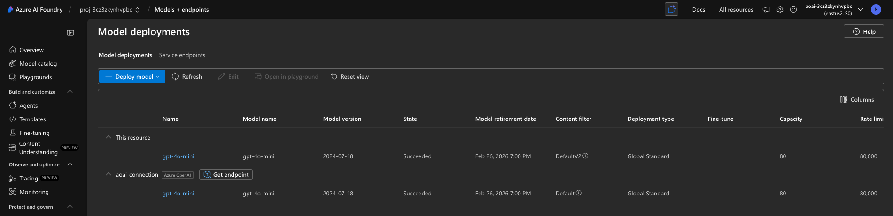
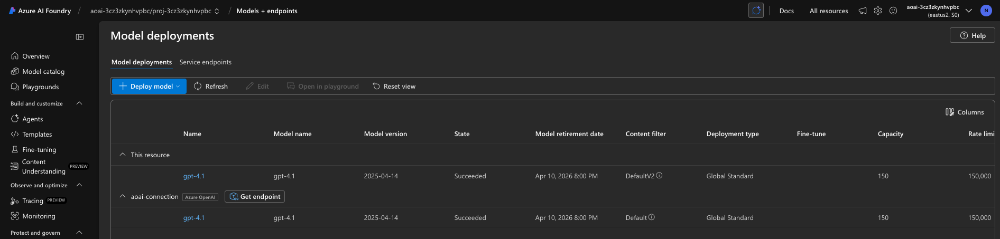

# 6. Teardown Infrastructure

!!! tip "BY THE END OF THIS MODULE YOU WILL BE ABLE TO"

    - [ ] Item
    - [ ] Item
    - [ ] Item

---

## Bonus Exercises

Before we tear down the project, take a few minutes to do some open-ended exploration.

!!! danger "NITYA-TODO: Outline some prompts to try"

---

## Deprovision Infra

1. Tearing down infrastructure is as easy as:
      
      ```bash title="" linenums="0"
      azd down --purge
      ```
1. The `--purge` flag ensures that it also purges soft-deleted Cognitive Service resources, thereby releasing quota held by these resources. Once complete you will see something like this:
      
      ```bash title="" linenums="0"
      ? Total resources to delete: 11, are you sure you want to continue? Yes
      Deleting your resources can take some time.
      (✓) Done: Deleted resource group rg-nitya-mshack-azd
      (✓) Done: Purging Cognitive Account: aoai-3cz3zkynhvpbc

      SUCCESS: Your application was removed from Azure in 11 minutes 4 seconds.
      ```

1. (Optional) If you now run `azd up` again, you will notice the gpt-4.1 model gets deployed since the environment variable was changed (and saved) in the local `.azure` folder. 

      Here is the model deployments **before**:

      

      And here it is **after**:
      


